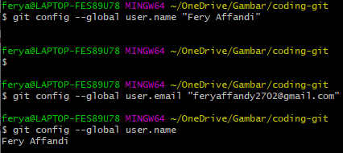

# Latihan-VCS1

**Nama : Fery Affandi**  

**Nim :  312010018**  

**Kelas : TI.20.A.1**  

## Langkah-langkah  penggunaan git 

* Download git terlebih dahulu dengan link berikut [click here](https://git-scm.com)  

* Setelah file terdownload, silahkan instalasi dengan referensi berikut ini : [Git installation guide](https://git-scm.com/book/en/v2/getting-Started-Installing-Git)  

  

* Setelah instalasi selesai, buka *software* **GitBash** pada menu di windows, dan lakukan pengecekan **versi**, dengan mengetik *syntax* berikut :  

`git --version`  

  

* Jika muncul tampilan **git version**, berarti Git sudah **Berhasil di install** dan bisa di **gunakan** Langkah pertama kita harus **mengkorfirmasikan user name** dan **email di git**, dengan mengetikkan *syntax* berikut :  

`git commit --global user.name "masukan nama anda"`  

`git commit --global user.email "masuka email anda"`  

  

* Buat akun di **Github**, seperti contoh dibawah ini. Dan lakukan verifikasi melalui akun email yang sudah terdaftar.

* Jika akun **Github** sudah selesai dibuat dan di verifikasi, proses selanjutnya silahkan  buat repository seperti gambar dibawah ini :  
**Penjelasan**

> *`Repository Name : (silahkan isi nama repository yang diinginkan seperti contoh saya ingin membuat repository latihan Latihan VCS)`*  

> *`Description : (Isi dengan deskripsi atau penjelasan tentang repository Anda)`*   

> *`Public / Private : (PIlih salah satu jenis repository akan bisa dilihan sama semua orang atau tidak)`*  

> *`Add a README.md file : Centang pada bagian ini jika Anda menginginkan file README.md ada di repository Anda`*  

> *`Add .gitignore : Merupakan sebuah file yang berisi daftar nama-nama file dan direktori yang akan diabaikan oleh Git.`*  

> *`Choose a license : Silahkan centang jika Anda memiliki lisensi pada repository yang akan dibuat Kemudian tekan tombol Create Repository untuk menyimpan`*  

  

* Jika repository sudah dibuat maka akan muncul tampilan seperti dibawah :  

  

