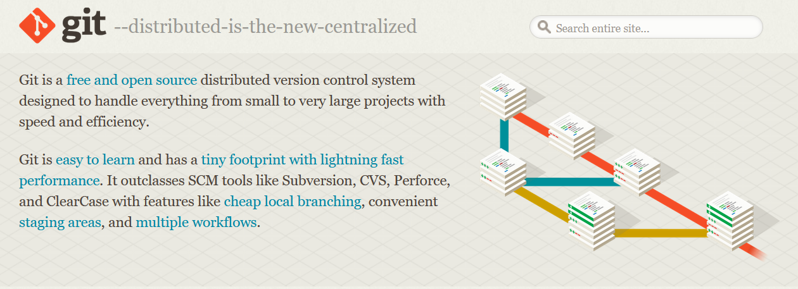

# Latihan-VCS1

**Nama : Fery Affandi**  

**Nim :  312010018**  

**Kelas : TI.20.A.1**  

## Langkah-langkah  penggunaan git 

* Download git terlebih dahulu dengan link berikut [click here](https://git-scm.com)  

* Setelah file terdownload, silahkan instalasi dengan referensi berikut ini : [Git installation guide](https://git-scm.com/book/en/v2/getting-Started-Installing-Git)  

  

* Setelah instalasi selesai, buka *software* **GitBash** pada menu di windows, dan lakukan pengecekan **versi**, dengan mengetik *syntax* berikut :  

`git --version`  

  

* Jika muncul tampilan **git version**, berarti Git sudah **Berhasil di install** dan bisa di **gunakan** Langkah pertama kita harus **mengkorfirmasikan user name** dan **email di git**, dengan mengetikkan *syntax* berikut :  

`git commit --global user.name "masukan nama anda"`  

`git commit --global user.email "masuka email anda"`  

